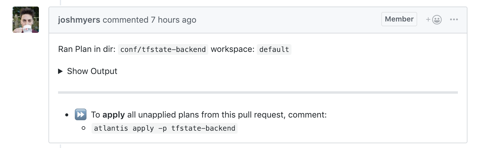
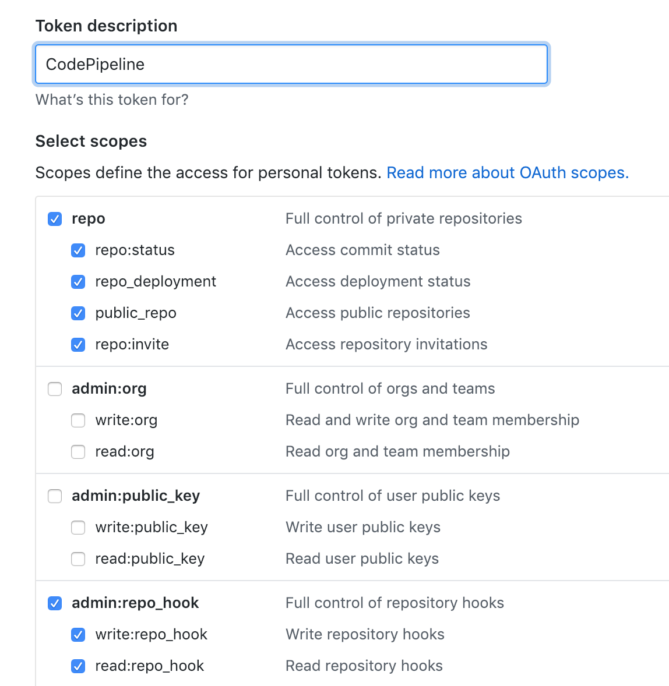

<!-- This file was automatically generated by the `build-harness`. Make all changes to `README.yaml` and run `make readme` to rebuild this file. -->
[![README Header][readme_header_img]][readme_header_link]

[![Cloud Posse][logo]](https://cpco.io/homepage)

# terraform-aws-ecs-atlantis [](https://travis-ci.org/cloudposse/terraform-aws-ecs-atlantis) [](https://github.com/cloudposse/terraform-aws-ecs-atlantis/releases/latest) [](https://slack.cloudposse.com)


A Terraform module for deploying [Atlantis](https://runatlantis.io) to an AWS ECS cluster.


---

This project is part of our comprehensive ["SweetOps"](https://cpco.io/sweetops) approach towards DevOps. 
[][share_email]
[][share_googleplus]
[][share_facebook]
[][share_reddit]
[][share_linkedin]
[][share_twitter]


[][terraform_modules]


It's 100% Open Source and licensed under the [APACHE2](LICENSE).


We literally have [*hundreds of terraform modules*][terraform_modules] that are Open Source and well-maintained. Check them out! 


## Screenshots



*Example of a Pull Request comment from running `terraform plan` using `atlantis`*


## Introduction


Atlantis enables GitOps workflows so that teams can collaborate on operations using Pull Requests. 

Under the hood, it's a small self-hosted daemon (`#golang`) that listens for Pull Request webhook events from GitHub.

With Atlantis, engineers can run `terraform plan` and `terraform apply` using "chat ops" type comments on the Pull Request.

### Features

This module provisions the following resources:

- ECS Atlantis web application, which includes:
    - ECR Docker registry
    - ALB target group, listener rule and alarms
    - ECS container definition (using a default backend)
    - ECS task definition and IAM role
    - ECS service and IAM role
    - ECS task autoscaling
    - ECS SNS based alarms
    - ECS Codepipeline to build our Atlantis image on GitHub release
    - ECS Codedeploy to deploy our ECS Atlantis web app
- SSH key pair for Atlantis to pull private Github repositories, which are written to SSM for reading with [chamber](https://github.com/segmentio/chamber)
- Route53 alias for Atlantis
- GitHub webhook to trigger Atlantis for a given repository

What this module does not provision:
  
  - ECS Cluster (BYOC)
  - ALB
  - ACM certificate
  - VPC
  - Subnets
  
## Caveats

- This project assumes that the repo being deployed defines a `Dockerfile` which runs `atlantis`. It might not work with the official version of atlantis. We use [`geodesic`](https://github.com/cloudposse/geodesic) as our docker base image.
- This project defines parameters which are not available in the *official version* of `atlantis`. Our [fork](https://github.com/cloudposse/atlantis) implements the ability to restrict `plan` and `apply` to GitHub teams.


### GitHub Repo Scopes

We suggest creating a personal access token for a GitHub bot user with the following scopes:

  - `repo`
    * `repo:status`
    * `repo_deployment`
    * `public_repo`
    * `repo:invite`
  - `admin:repo_hook`
    * `write:repo_hook`
    * `read:repo_hook`



**IMPORTANT:** Do not commit this `github_oauth_token` to source control (e.g. via `terraform.tvfars`). 

## Usage


**NOTE:** if no `github_oauth_token` is set, this module attempts to look one up from SSM. 

```
module "atlantis" {
  source = "git::https://github.com/cloudposse/terraform-aws-ecs-atlantis.git?ref=master"
  enabled   = "true"
  name      = "${var.name}"
  namespace = "${var.namespace}"
  region    = "${var.region}"
  stage     = "${var.stage}"

  atlantis_gh_team_whitelist = "admins:*,engineering:plan"
  atlantis_gh_user           = "atlantis_bot"
  atlantis_repo_whitelist    = ["github.com/testing.example.co/*"]

  alb_arn_suffix    = "${module.alb.alb_arn_suffix}"
  alb_dns_name      = "${module.alb.alb_dns_name}"
  alb_listener_arns = ["${module.alb.listener_arns}"]
  alb_name          = "${module.alb.alb_name}"
  alb_zone_id       = "${module.alb.alb_zone_id}"

  domain_name        = "${var.domain_name}"
  ecs_cluster_arn    = "${aws_ecs_cluster.default.arn}"
  ecs_cluster_name   = "${aws_ecs_cluster.default.name}"
  repo_name          = "testing.example.co"
  repo_owner         = "example_org"
  private_subnet_ids = ["${module.subnets.private_subnet_ids}"]
  security_group_ids = ["${module.vpc.vpc_default_security_group_id}"]
  vpc_id             = "${module.vpc.vpc_id}"
}
```


## Makefile Targets
```
Available targets:

  help                                Help screen
  help/all                            Display help for all targets
  help/short                          This help short screen
  lint                                Lint terraform code

```
## Inputs

| Name | Description | Type | Default | Required |
|------|-------------|:----:|:-----:|:-----:|
| alb_arn_suffix | The ARN suffix of the ALB | string | - | yes |
| alb_dns_name | DNS name of ALB | string | - | yes |
| alb_ingress_paths | Path pattern to match (a maximum of 1 can be defined), at least one of hosts or paths must be set | list | `<list>` | no |
| alb_listener_arns | A list of ALB listener ARNs | list | - | yes |
| alb_name | The Name of the ALB | string | - | yes |
| alb_target_group_alarms_alarm_actions | A list of ARNs (i.e. SNS Topic ARN) to execute when ALB Target Group alarms transition into an ALARM state from any other state. | list | `<list>` | no |
| alb_target_group_alarms_insufficient_data_actions | A list of ARNs (i.e. SNS Topic ARN) to execute when ALB Target Group alarms transition into an INSUFFICIENT_DATA state from any other state. | list | `<list>` | no |
| alb_target_group_alarms_ok_actions | A list of ARNs (i.e. SNS Topic ARN) to execute when ALB Target Group alarms transition into an OK state from any other state. | list | `<list>` | no |
| alb_zone_id | The ID of the zone in which ALB is provisioned | string | - | yes |
| atlantis_allow_repo_config | Allow Atlantis to use atlantis.yaml | string | `true` | no |
| atlantis_gh_team_whitelist | Atlantis GitHub team whitelist | string | `` | no |
| atlantis_gh_user | Atlantis GitHub user | string | - | yes |
| atlantis_gh_webhook_secret | Atlantis GitHub webhook secret | string | `` | no |
| atlantis_log_level | Atlantis log level | string | `info` | no |
| atlantis_port | Atlantis container port | string | `4141` | no |
| atlantis_repo_config | Path to atlantis config file | string | `atlantis.yaml` | no |
| atlantis_repo_whitelist | Whitelist of repositories Atlantis will accept webhooks from | list | `<list>` | no |
| atlantis_wake_word | Wake world for Atlantis | string | `atlantis` | no |
| atlantis_webhook_format | Template for the Atlantis webhook URL which is populated with the hostname | string | `https://%s/events` | no |
| attributes | Additional attributes (e.g. `1`) | list | `<list>` | no |
| autoscaling_max_capacity | Atlantis maximum tasks to run | string | `1` | no |
| autoscaling_min_capacity | Atlantis minimum tasks to run | string | `1` | no |
| branch | Atlantis branch of the GitHub repository, _e.g._ `master` | string | `master` | no |
| build_timeout | How long in minutes, from 5 to 480 (8 hours), for AWS CodeBuild to wait until timing out any related build that does not get marked as completed. | string | `5` | no |
| chamber_format | Format to store parameters in SSM, for consumption with chamber | string | `/%s/%s` | no |
| chamber_service | SSM parameter service name for use with chamber. This is used in chamber_format where /$chamber_service/$parameter would be the default. | string | `atlantis` | no |
| container_cpu | Atlantis CPUs per task | string | `256` | no |
| container_memory | Atlantis memory per task | string | `512` | no |
| default_backend_image | ECS default (bootstrap) image | string | `cloudposse/default-backend:0.1.2` | no |
| delimiter | Delimiter to be used between `namespace`, `stage`, `name` and `attributes` | string | `-` | no |
| desired_count | Atlantis desired number of tasks | string | `1` | no |
| domain_name | A domain name for which the certificate should be issued | string | - | yes |
| ecs_cluster_arn | ARN of the ECS cluster to deploy Atlantis | string | - | yes |
| ecs_cluster_name | Name of the ECS cluster to deploy Atlantis | string | - | yes |
| enabled | Whether to create the resources. Set to `false` to prevent the module from creating any resources | string | `false` | no |
| github_oauth_token | GitHub Oauth token. If not provided the token is looked up from SSM. | string | `` | no |
| github_oauth_token_ssm_name | SSM param name to lookup GitHub OAuth token if not provided | string | `` | no |
| healthcheck_path | Healthcheck path | string | `/healthz` | no |
| hostname | Atlantis URL | string | `` | no |
| kms_key_id | KMS key ID used to encrypt SSM SecureString parameters | string | `` | no |
| name | Application or solution name (e.g. `app`) | string | `ecs` | no |
| namespace | Namespace (e.g. `eg` or `cp`) | string | - | yes |
| overwrite_ssm_parameter | Whether to overwrite an existing SSM parameter | string | `true` | no |
| policy_arn | Permission to grant to atlantis server | string | `arn:aws:iam::aws:policy/AdministratorAccess` | no |
| private_subnet_ids | The private subnet IDs | list | `<list>` | no |
| region | AWS Region for Atlantis deployment | string | `us-west-2` | no |
| repo_name | GitHub repository name of the atlantis to be built and deployed to ECS. | string | - | yes |
| repo_owner | GitHub organization containing the Atlantis repository | string | - | yes |
| security_group_ids | Additional Security Group IDs to allow into ECS Service. | list | `<list>` | no |
| short_name | Alantis Short DNS name (E.g. `atlantis`) | string | `atlantis` | no |
| ssh_private_key_name | Atlantis SSH private key name | string | `atlantis_ssh_private_key` | no |
| ssh_public_key_name | Atlantis SSH public key name | string | `atlantis_ssh_public_key` | no |
| stage | Stage (e.g. `prod`, `dev`, `staging`) | string | - | yes |
| tags | Additional tags (e.g. map(`BusinessUnit`,`XYZ`) | map | `<map>` | no |
| vpc_id | VPC ID for the ECS Cluster | string | - | yes |
| webhook_events | A list of events which should trigger the webhook. | list | `<list>` | no |
| webhook_secret_length | GitHub webhook secret length | string | `32` | no |

## Outputs

| Name | Description |
|------|-------------|
| atlantis_ssh_public_key | Atlantis SSH Public Key |
| badge_url | the url of the build badge when badge_enabled is enabled |


## Share the Love 

Like this project? Please give it a ★ on [our GitHub](https://github.com/cloudposse/terraform-aws-ecs-atlantis)! (it helps us **a lot**) 

Are you using this project or any of our other projects? Consider [leaving a testimonial][testimonial]. =)


## Related Projects

Check out these related projects.

- [terraform-aws-ecs-web-app](https://github.com/cloudposse/terraform-aws-ecs-web-app) - Terraform module that implements a web app on ECS and supporting AWS resources
- [terraform-aws-alb](https://github.com/cloudposse/terraform-aws-alb) - Terraform module to provision a standard ALB for HTTP/HTTP traffic
- [terraform-aws-alb-ingress](https://github.com/cloudposse/terraform-aws-alb-ingress) - Terraform module to provision an HTTP style ingress rule based on hostname and path for an ALB
- [terraform-aws-codebuild](https://github.com/cloudposse/terraform-aws-codebuild) - Terraform Module to easily leverage AWS CodeBuild for Continuous Integration
- [terraform-aws-ecr](https://github.com/cloudposse/terraform-aws-ecr) - Terraform Module to manage Docker Container Registries on AWS ECR
- [terraform-aws-ecs-alb-service-task](https://github.com/cloudposse/terraform-aws-ecs-alb-service-task) - Terraform module which implements an ECS service which exposes a web service via ALB.
- [terraform-aws-ecs-codepipeline](https://github.com/cloudposse/terraform-aws-ecs-codepipeline) - Terraform Module for CI/CD with AWS Code Pipeline and Code Build for ECS
- [terraform-aws-ecs-container-definition](https://github.com/cloudposse/terraform-aws-ecs-container-definition) - Terraform module to generate well-formed JSON documents that are passed to the aws_ecs_task_definition Terraform resource
- [terraform-aws-lb-s3-bucket](https://github.com/cloudposse/terraform-aws-lb-s3-bucket) - Terraform module to provision an S3 bucket with built in IAM policy to allow AWS Load Balancers to ship access logs.


## References

For additional context, refer to some of these links. 

- [atlantis](https://runatlantis.io) - Official home of the Atlantis project


## Help

**Got a question?**

File a GitHub [issue](https://github.com/cloudposse/terraform-aws-ecs-atlantis/issues), send us an [email][email] or join our [Slack Community][slack].

[![README Commercial Support][readme_commercial_support_img]][readme_commercial_support_link]

## Commercial Support

Work directly with our team of DevOps experts via email, slack, and video conferencing. 

We provide [*commercial support*][commercial_support] for all of our [Open Source][github] projects. As a *Dedicated Support* customer, you have access to our team of subject matter experts at a fraction of the cost of a full-time engineer. 

[][email]

- **Questions.** We'll use a Shared Slack channel between your team and ours.
- **Troubleshooting.** We'll help you triage why things aren't working.
- **Code Reviews.** We'll review your Pull Requests and provide constructive feedback.
- **Bug Fixes.** We'll rapidly work to fix any bugs in our projects.
- **Build New Terraform Modules.** We'll [develop original modules][module_development] to provision infrastructure.
- **Cloud Architecture.** We'll assist with your cloud strategy and design.
- **Implementation.** We'll provide hands-on support to implement our reference architectures. 


## Terraform Module Development

Are you interested in custom Terraform module development? Submit your inquiry using [our form][module_development] today and we'll get back to you ASAP.


## Slack Community

Join our [Open Source Community][slack] on Slack. It's **FREE** for everyone! Our "SweetOps" community is where you get to talk with others who share a similar vision for how to rollout and manage infrastructure. This is the best place to talk shop, ask questions, solicit feedback, and work together as a community to build totally *sweet* infrastructure.

## Newsletter

Signup for [our newsletter][newsletter] that covers everything on our technology radar.  Receive updates on what we're up to on GitHub as well as awesome new projects we discover. 

## Contributing

### Bug Reports & Feature Requests

Please use the [issue tracker](https://github.com/cloudposse/terraform-aws-ecs-atlantis/issues) to report any bugs or file feature requests.

### Developing

If you are interested in being a contributor and want to get involved in developing this project or [help out](https://cpco.io/help-out) with our other projects, we would love to hear from you! Shoot us an [email][email].

In general, PRs are welcome. We follow the typical "fork-and-pull" Git workflow.

 1. **Fork** the repo on GitHub
 2. **Clone** the project to your own machine
 3. **Commit** changes to your own branch
 4. **Push** your work back up to your fork
 5. Submit a **Pull Request** so that we can review your changes

**NOTE:** Be sure to merge the latest changes from "upstream" before making a pull request!


## Copyright

Copyright © 2017-2019 [Cloud Posse, LLC](https://cpco.io/copyright)


## License 

[](https://opensource.org/licenses/Apache-2.0) 

See [LICENSE](LICENSE) for full details.

    Licensed to the Apache Software Foundation (ASF) under one
    or more contributor license agreements.  See the NOTICE file
    distributed with this work for additional information
    regarding copyright ownership.  The ASF licenses this file
    to you under the Apache License, Version 2.0 (the
    "License"); you may not use this file except in compliance
    with the License.  You may obtain a copy of the License at

      https://www.apache.org/licenses/LICENSE-2.0

    Unless required by applicable law or agreed to in writing,
    software distributed under the License is distributed on an
    "AS IS" BASIS, WITHOUT WARRANTIES OR CONDITIONS OF ANY
    KIND, either express or implied.  See the License for the
    specific language governing permissions and limitations
    under the License.


## Trademarks

All other trademarks referenced herein are the property of their respective owners.

## About

This project is maintained and funded by [Cloud Posse, LLC][website]. Like it? Please let us know by [leaving a testimonial][testimonial]!

[![Cloud Posse][logo]][website]

We're a [DevOps Professional Services][hire] company based in Los Angeles, CA. We ❤️  [Open Source Software][we_love_open_source].

We offer [paid support][commercial_support] on all of our projects.  

Check out [our other projects][github], [follow us on twitter][twitter], [apply for a job][jobs], or [hire us][hire] to help with your cloud strategy and implementation.


### Contributors

|  [![Josh Myers][joshmyers_avatar]][joshmyers_homepage]<br/>[Josh Myers][joshmyers_homepage] |
|---|

  [joshmyers_homepage]: https://github.com/joshmyers
  [joshmyers_avatar]: https://github.com/joshmyers.png?size=150


[![README Footer][readme_footer_img]][readme_footer_link]
[![Beacon][beacon]][website]

  [logo]: https://cloudposse.com/logo-300x69.svg
  [docs]: https://cpco.io/docs
  [website]: https://cpco.io/homepage
  [github]: https://cpco.io/github
  [jobs]: https://cpco.io/jobs
  [hire]: https://cpco.io/hire
  [slack]: https://cpco.io/slack
  [linkedin]: https://cpco.io/linkedin
  [twitter]: https://cpco.io/twitter
  [testimonial]: https://cpco.io/leave-testimonial
  [newsletter]: https://cpco.io/newsletter
  [email]: https://cpco.io/email
  [commercial_support]: https://cpco.io/commercial-support
  [we_love_open_source]: https://cpco.io/we-love-open-source
  [module_development]: https://cpco.io/module-development
  [terraform_modules]: https://cpco.io/terraform-modules
  [readme_header_img]: https://cloudposse.com/readme/header/img?repo=cloudposse/terraform-aws-ecs-atlantis
  [readme_header_link]: https://cloudposse.com/readme/header/link?repo=cloudposse/terraform-aws-ecs-atlantis
  [readme_footer_img]: https://cloudposse.com/readme/footer/img?repo=cloudposse/terraform-aws-ecs-atlantis
  [readme_footer_link]: https://cloudposse.com/readme/footer/link?repo=cloudposse/terraform-aws-ecs-atlantis
  [readme_commercial_support_img]: https://cloudposse.com/readme/commercial-support/img?repo=cloudposse/terraform-aws-ecs-atlantis
  [readme_commercial_support_link]: https://cloudposse.com/readme/commercial-support/link?repo=cloudposse/terraform-aws-ecs-atlantis
  [share_twitter]: https://twitter.com/intent/tweet/?text=terraform-aws-ecs-atlantis&url=https://github.com/cloudposse/terraform-aws-ecs-atlantis
  [share_linkedin]: https://www.linkedin.com/shareArticle?mini=true&title=terraform-aws-ecs-atlantis&url=https://github.com/cloudposse/terraform-aws-ecs-atlantis
  [share_reddit]: https://reddit.com/submit/?url=https://github.com/cloudposse/terraform-aws-ecs-atlantis
  [share_facebook]: https://facebook.com/sharer/sharer.php?u=https://github.com/cloudposse/terraform-aws-ecs-atlantis
  [share_googleplus]: https://plus.google.com/share?url=https://github.com/cloudposse/terraform-aws-ecs-atlantis
  [share_email]: mailto:?subject=terraform-aws-ecs-atlantis&body=https://github.com/cloudposse/terraform-aws-ecs-atlantis
  [beacon]: https://ga-beacon.cloudposse.com/UA-76589703-4/cloudposse/terraform-aws-ecs-atlantis?pixel&cs=github&cm=readme&an=terraform-aws-ecs-atlantis
